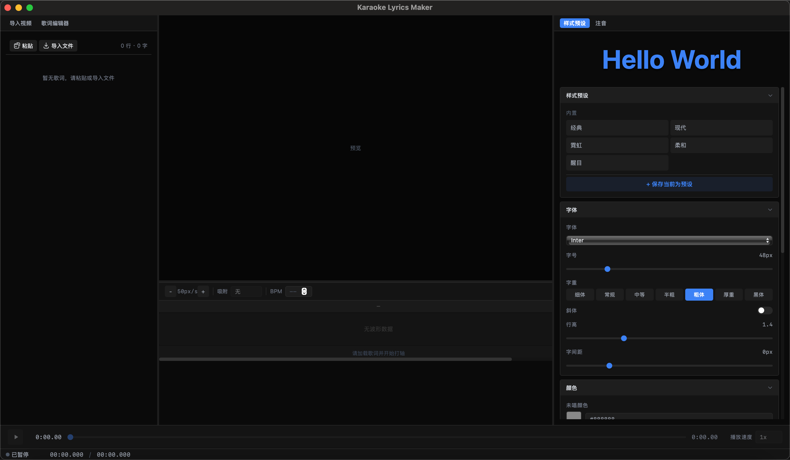

<p align="center">
  <h1 align="center">🎤 Karaoke Lyrics Maker</h1>
  <p align="center">クロスプラットフォームカラオケ歌詞作成ソフト</p>
  <p align="center">
    <a href="../../README.md">简体中文</a> | <a href="./README.en.md">English</a> | <a href="./README.zh-TW.md">繁體中文</a> | <a href="./README.ja.md">日本語</a>
  </p>
</p>

---

## ✨ 機能

- **メディアインポート** — MP4/MKV/MOV/AVI/FLV 動画および MP3/WAV/FLAC/AAC/OGG 音声に対応
- **歌詞入力** — 手動入力、テキスト貼り付け、LRC/SRT/ASS 字幕ファイルのインポート
- **キータイミング** — 音声再生中にキー（スペース/カスタム）を押して各文字の開始時間と終了時間をマーク
- **一文字ずつの塗りつぶし** — 歌詞の一文字ずつを塗りつぶすアニメーションをリアルタイムプレビュー（2色グラデーション、複数の塗り方向）
- **読み方注釈** — 漢字の上にピンイン、日本語漢字の上に仮名を表示。自動注釈と手動編集に対応
- **スタイル編集** — フォント、色、縁取り、影、発光、グラデーションなどの文字エフェクト、5つの内蔵プリセット
- **タイミング微調整** — 波形表示で正確な位置合わせ、ドラッグでタイミング調整、波形ピークへのスナップ
- **プロジェクト管理** — プロジェクトファイル（.klproj）の保存/読み込み、すべての編集データを含む
- **エクスポート** — 歌詞付き動画のレンダリング、LRC ファイルの出力、一文字タイムスタンプ JSON、ASS 字幕
- **クロスプラットフォーム** — Windows / macOS / Linux でネイティブ動作
- **多言語インターフェース** — 简体中文、繁體中文、日本語、English
- **軽量・高効率** — インストーラ < 30MB、メモリ使用量 < 200MB、60fps スムーズなレンダリング

## 📸 スクリーンショット



## 🚀 クイックスタート

### 環境要件

- [Node.js](https://nodejs.org/) 18+
- [Rust](https://www.rust-lang.org/) 1.70+
- [FFmpeg](https://ffmpeg.org/)（動画エクスポートにのみ必要）

### インストール

```bash
# リポジトリをクローン
git clone https://github.com/your-username/karaoke-lyrics-maker.git
cd karaoke-lyrics-maker

# フロントエンド依存関係をインストール
npm install

# 開発モードを起動
npm run tauri dev
```

### ビルド

```bash
# プロダクションバージョンをビルド
npm run tauri build
```

ビルド成果物は `src-tauri/target/release/bundle/` に配置されます。

### macOS セキュリティ警告について

macOS ユーザーがアプリを初めて開くと「開けません」というセキュリティ警告が表示されます。以下の手順で解決できます：

1. `.dmg` をダブルクリックしてインストールし、アプリを Applications フォルダにドラッグします
2. 初めて開くときに「開発者を検証できないため開けません」と表示されます
3. **システム設定 → プライバシーとセキュリティ** を開き、下部にブロックされたアプリが表示されます
4. **「それでも開く」** をクリックします
5. 再度 **「開く」** を確認します
6. 以降は通常通り使用でき、再操作は不要です

## 📖 ユーザーガイド

### 基本ワークフロー

1. **メディアをインポート** — ドラッグ＆ドロップまたはクリックで動画/音声ファイルをインポート
2. **歌詞を入力** — 歌詞テキストを貼り付けるか、LRC/SRT/ASS ファイルをインポート
3. **キータイミング** — F2 でタイミングモードに入り、再生中にスペースキーで各文字をマーク
4. **タイミングを微調整** — タイムライン上のマーカーをドラッグして時間を調整
5. **スタイルを編集** — プリセットを選択するか、フォント、色、縁取りなどをカスタマイズ
6. **エクスポート** — 動画（要 FFmpeg）、LRC、JSON、ASS ファイルとして出力

### ショートカットキー

| ショートカット | 機能 |
|----------------|------|
| `Space` | 再生/一時停止 / タイミングマーク |
| `Esc` | 再生を停止 |
| `Backspace` | 最後のマークを元に戻す |
| `F2` | タイミングモードに入る/出る |
| `F3` | 間奏行をマーク（スキップ） |
| `←` / `→` | 100ms 微調整 |
| `Ctrl+S` | プロジェクトを保存 |
| `Ctrl+O` | ファイルを開く |
| `Ctrl+E` | エクスポートダイアログを開く |
| `Ctrl+,` | 設定を開く |

### タイミングモード

| モード | 説明 | 最適な場面 |
|--------|------|------------|
| リアルタイムタイミング | 再生中に一文字ずつキーを押してマーク | 汎用的、最も一般的 |
| タップタイミング | リズムに合わせて一定間隔でキーを押す、システムが自動配分 | リズム感の強い曲 |
| フレーズタイミング | 各フレーズの開始時間と終了時間をマーク、フレーズ内で均等配分 | クイック下書き |

## 🏗️ 技術アーキテクチャ

| レイヤー | 技術 |
|----------|------|
| フレームワーク | Tauri 2.x（Rust バックエンド + WebView フロントエンド） |
| フロントエンド | React 18 + TypeScript + Vite |
| 状態管理 | Zustand |
| スタイリング | Tailwind CSS |
| レンダリング | Canvas API（歌詞塗りつぶしアニメーション） |
| 音声 | Web Audio API（正確なタイミング） + Symphonia（波形生成） |
| 動画エクスポート | FFmpeg（ASS 字幕フィルター） |
| 国際化 | react-i18next（4言語） |

### プロジェクト構造

```
src/                          # フロントエンドソース
├── components/               # React コンポーネント
│   ├── layout/              #   レイアウト（MenuBar, MainLayout, StatusBar）
│   ├── media/               #   メディア（VideoPlayer, PlaybackControls）
│   ├── lyrics/              #   歌詞（LyricTextEditor, LyricsOverlay）
│   ├── timeline/            #   タイムライン（TimelinePanel, WaveformDisplay）
│   ├── style/               #   スタイル（StylePanel, ColorPicker）
│   ├── pronunciation/       #   発音（PronunciationPanel）
│   ├── export/              #   エクスポート（ExportDialog）
│   └── settings/            #   設定（SettingsDialog）
├── engine/                   # レンダリングエンジン
│   ├── CanvasRenderer.ts   #   Canvas レンダラー（塗り/影/発光）
│   ├── TimingEngine.ts     #   タイミングエンジン（ステートマシン）
│   ├── PlaybackClock.ts    #   精密クロック（デュアルアンカー）
│   └── TextLayout.ts       #   テキストレイアウト
├── store/                   # Zustand 状態管理
├── services/                # ビジネスサービス
├── i18n/                    # 国際化（en/zh-CN/zh-TW/ja-JP）
└── types/                   # TypeScript 型定義

src-tauri/                    # Rust バックエンド
├── src/
│   ├── commands/            #   Tauri IPC コマンド
│   ├── engine/              #   コアエンジン
│   │   ├── media/          #     メディア探知/波形生成
│   │   ├── export/         #     LRC/JSON/ASS/動画エクスポート
│   │   └── pronunciation/  #     ピンイン辞書
│   └── menu.rs             #   macOS ネイティブメニュー
└── capabilities/            # Tauri パーミッション設定

docs/                         # 開発ドキュメント（ローカル非公開）
```

## 🌍 国際化

アプリケーションは以下の言語に対応しています：

| 言語 | コード | 状態 |
|------|--------|------|
| 簡体字中国語 | zh-CN | ✅ 完了 |
| 繁体字中国語 | zh-TW | ✅ 完了 |
| 日本語 | ja-JP | ✅ 完了 |
| English | en | ✅ 完了 |

言語は設定で切り替え可能で、macOS のネイティブメニューバーも同期して更新されます。

## 📋 エクスポート形式

| 形式 | 説明 |
|------|------|
| LRC | 標準歌詞ファイル（行単位のタイミング） |
| 拡張 LRC | 一文字ごとのタイムタグ付き |
| JSON | 一文字タイムスタンプ + 発音データ |
| ASS | 字幕ファイル（カラオケ塗りつぶし効果） |
| 動画 | 歌詞オーバーレイ付き MP4（要 FFmpeg） |

## 🤝 コントリビューション

Issue や Pull Request を歓迎します！

1. このリポジトリを Fork してください
2. フィーチャーブランチを作成 (`git checkout -b feature/amazing-feature`)
3. 変更をコミット (`git commit -m 'Add amazing feature'`)
4. ブランチにプッシュ (`git push origin feature/amazing-feature`)
5. Pull Request を作成してください

## 📄 ライセンス

このプロジェクトは [MIT ライセンス](./LICENSE) の下で提供されています。

## 🙏 謝辞

- [Tauri](https://tauri.app/) — クロスプラットフォームデスクトップアプリケーションフレームワーク
- [Symphonia](https://github.com/pdeljanov/Symphonia) — Rust 音声デコードライブラリ
- [CC-CEDICT](https://cc-cedict.org/wiki/) — 中国語辞書
- [JMDict](https://www.edrdg.org/jmdict/j_jmdict.html) — 日本語辞書
